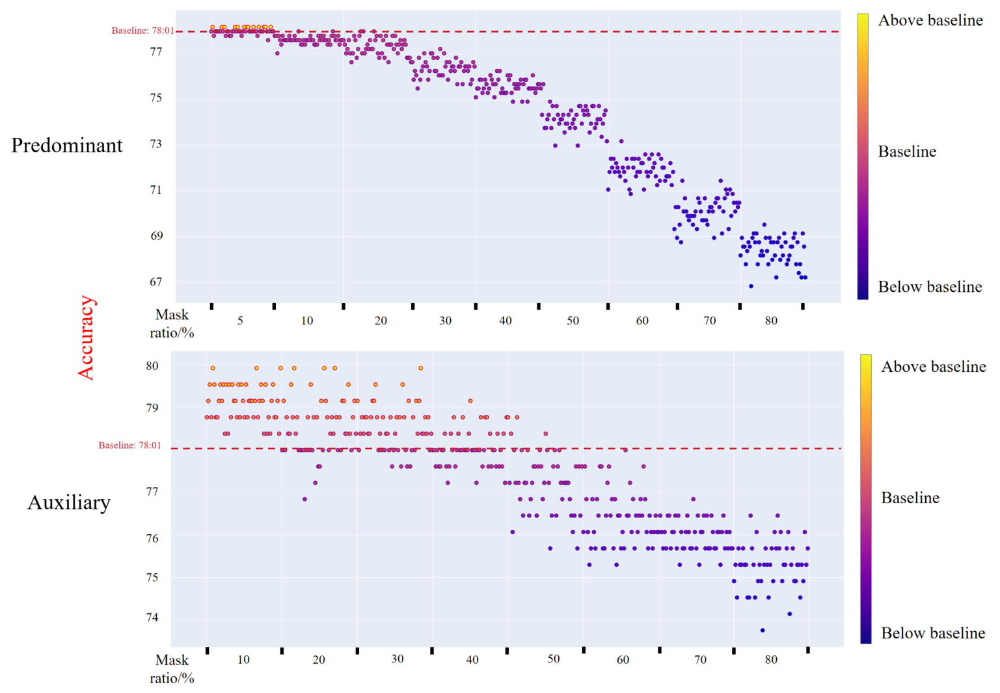
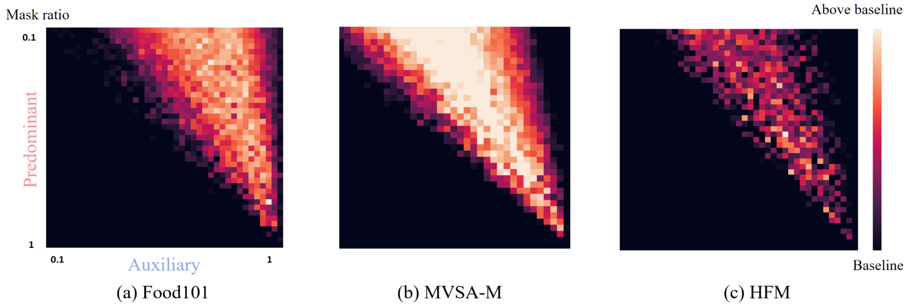
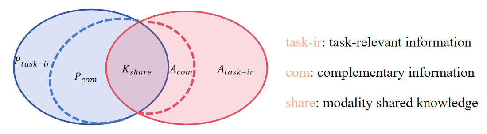

## Rebuttal_For_IMML

# Figure 1.

# Figure 2. We conduct the same mask experiments with Figure (1c) in the manuscript. In Figure 2 of this GitHub, the coordinates settings of subfigure (2b) and (2c) are the same as the (2a).

# Figure 3. The illustration of basic assumption in multi-modal learning.

